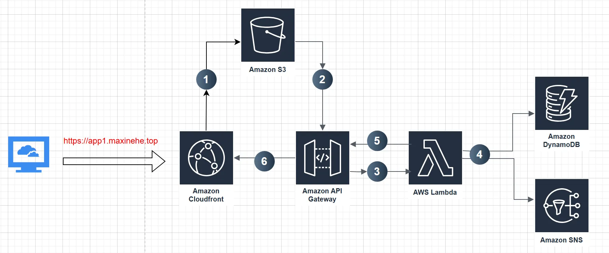
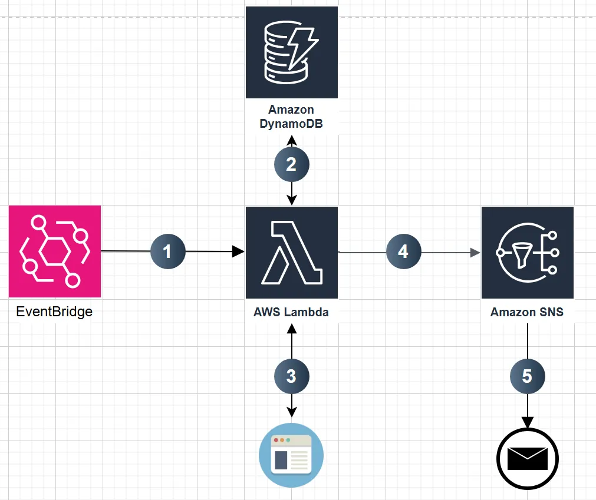

# ebay-price-tracker-aws
The `Task1` and `Task2` directories contain Terraform files for their respective tasks.

The `tests` directory houses pytest files for the `Task1` Lambda function. 

The `cleanup_script` directory contains a python script to remove SNS topics created by the application. Run this script before `terraform destroy` when removing the application.

## Task1 workflow:

Step 1: CloudFront serves as the primary entry point for our application. This content delivery network significantly enhances webpage loading speeds and offers several key advantages. Most crucially, it allows us to serve static files directly from S3 without the need to enable S3’s public static web hosting feature.

Step 2: The JavaScript code running in the user’s browser performs initial validations on the input. When the user clicks the “Submit” button, the frontend sends the validated data as a request to our API Gateway.

Step 3: Upon receiving the request, the API Gateway acts as an intermediary, triggering our Lambda function in the backend.

Step 4: Our Lambda function, the core of our backend logic, performs several critical tasks:

- URL Validation: It first checks if the submitted URL corresponds to a valid, existing item on eBay.
- DynamoDB Check: The function then queries our DynamoDB to see if the URL already exists in our database.
    - If the URL is found, it adds the new email to the list of subscribers for that item.
    - If the URL is not found in DynamoDB, the function creates a new entry.

Step 5: Lambda function sends reply to API gateway.

Step 6: API gateway then passes the results to the cloudfront and the original domain.

## Task2 workflow:

Step 1: Amazon EventBridge sets up a periodic schedule for our price checking process.

Step 2: Lambda reads all entries from DynamoDB.

Step 3: Lambda checks the current price for each item using the URL stored in the database.

Step 4: If there’s a price drop, Lambda triggers the corresponding SNS topic to notify subscribers.